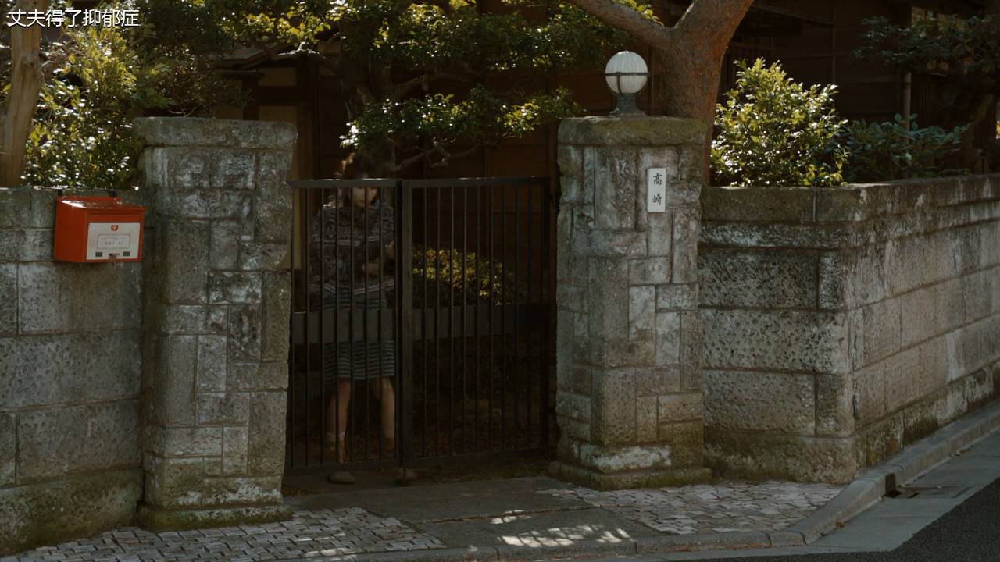

### Centos7搭建流媒体服务器

**流媒体服务器采用nginx+rtmp插件实现**

##### 首先编译安装nginx+rtmp流媒体服务器

安装git

```shell
yum -y install git	
```

下载nginx-rtmp-module插件

```shell
git clone https://github.com/arut/nginx-rtmp-module.git
```

安装Openssl

```shell
yum -y install openssl openssl-devel
```

去官网下载安装nginx并解压

```shell
tar -xvf nginx-1.16.1.tar.gz
```

开始nginx的编译安装（nginx-rtmp-module和nginx放在同一级目录）

```shell
# configure
$ ./configure \
--add-module=../nginx-rtmp-module \
--with-http_ssl_module
```

当配置成功以后开始编译并安装

```shell
make && make install
```

默认情况下, nginx会把日志、程序、配置文件等等全部放在/usr/local/nginx下面

开始配置nginx.conf文件，整个配置如下：

```shell
user  root;  # 使用root用户来启动nginx
worker_processes  1;
events {
    worker_connections  1024;
}
http {
    include       mime.types;
    default_type  application/octet-stream;
    sendfile        on;
    keepalive_timeout  65;
    server {
        listen       80;
        server_name  localhost;
        location / {
            root   html;
            index  index.html index.htm;
        }
        # 配置流媒体服务器的配置目录
        location /stat {
            rtmp_stat all;
            rtmp_stat_stylesheet stat.xsl;
        }
        location /stat.xsl {
            root /root/nginx-rtmp-module;
        }
        # redirect server error pages to the static page /50x.html
        #
        error_page   500 502 503 504  /50x.html;
        location = /50x.html {
            root   html;
        }
    }
}

# rmtp服务器配置
rtmp {
    server {
        listen 8007;
        chunk_size 4096;
        application live {  # live是直播的前缀地址, 可以修改
            live on;
        }
    }
}
```

同样, 视频点播的配置如下：

```shell
rtmp {
	server {
		listen 8007;
		chunk_size 4096;
		application vod {  # vod是点播的前缀地址, 可以修改
			play /opt/video/vod;  # 用来进行点播的文件存放位置
		}
	}
}
```

**只要将视频存放到/opt/video/vod位置, 就可以使用vlc播放器直接读取视频, 并拥有拖放播放进度等功能——即普通的网络视频播放功能**

##### 使用ffmpeg对流媒体服务进行推流

流媒体服务器的组成路径为

```shell
rtmp://[主机]:[端口]/live/[视频名称]
```

例如：

```shell
rtmp://192.168.147.131:8007/live/video
```

知道了流媒体服务器的地址就可以使用ffmpeg向流媒体服务器进行视频推流，推流命令如下：

```shell
ffmpeg -re -i [视频路径] -c oopy -f flv [推流地址]
```

例如:

```shell
ffmpeg -re -i "G:\Movies\丈夫得了抑郁症 ツレがうつになりまして。 2011.mp4" -c copy -f flv rtmp://192.168.147.131:8007/live/video
```

推流结束后，就可以使用任何一款vlc播放器来进行拉流，这样就可以观看直播了，这里一potplay播放器为例


在如下播放器上面输入直播地址就可以播放视频


#### 其他

##### 给直播视频添加文字水印

首先要将字体拷贝到ffmpeg程序所在目录下面，这里进入`C:\Windows\Fonts`目录，然后把里面的微软雅黑拷贝到ffmpeg所在目录，接着使用带水印的命令来推流，命令如下：

```shell
ffmpeg -re -i "G:\Movies\丈夫得了抑郁症 ツレがうつになりまして。 2011.mp4" -vf "drawtext=fontfile=msyh.ttc: text='丈夫得了抑郁症':x=10:y=10:fontsize=24:fontcolor=white:shadowy=2" -vcodec libx264 -acodec aac -f flv rtmp://192.168.147.131:8007/live/video
```

其中-vf参数所带的就是直播水印，效果如下（看视频左上角）：


